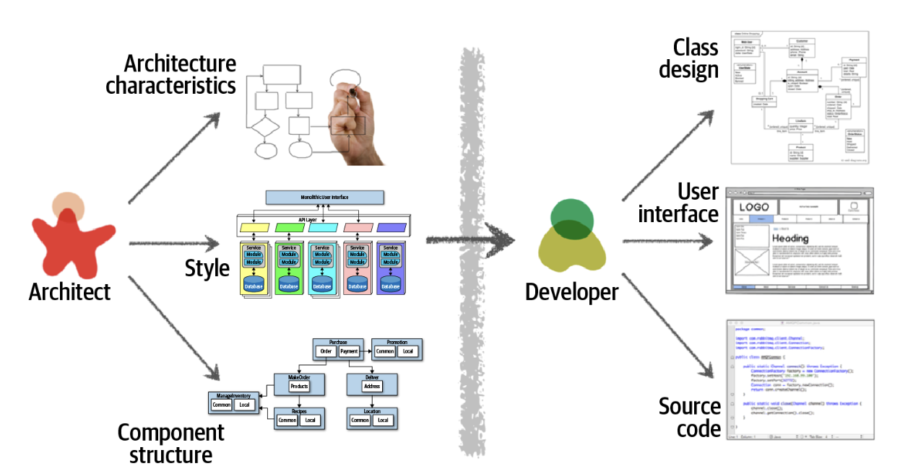
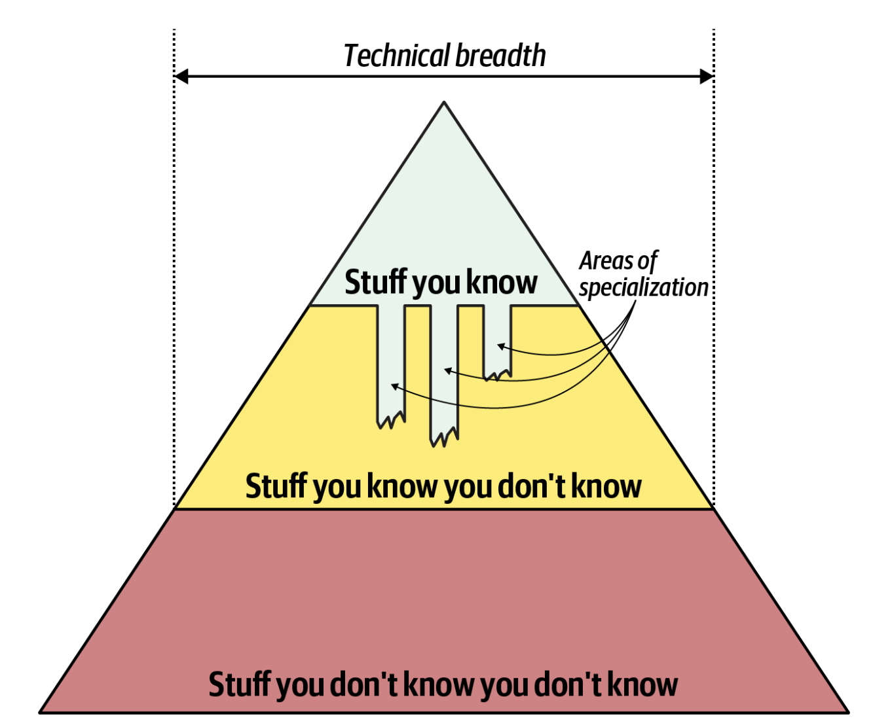
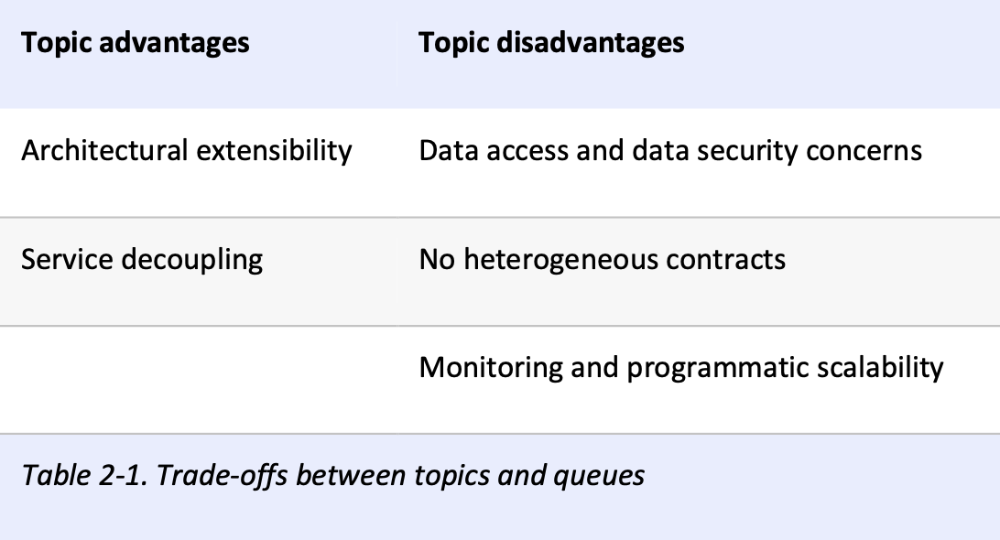

# Expectations of an Architect
### roles and responsibilities of architects
The first key to effectiveness and success in the software architect role depends on understanding and practicing each of these expectations.

- ### Make Architecture Decisions
An architect should `guide rather than specify technology choices` or might need to make specific technology decisions in order to preserve a particular architectural characteristic.
### 🤔 ตัดสินใจเกี่ยวกับเทคโนโลยีที่ทีมจะใช้ในการพัฒนาซอฟต์แวร์

- ### Continually Analyze the Architecture
An architect is expected to continually analyze the architecture and current technology environment and `then recommend solutions for improvement`.

An architect must holistically analyze changes in technology and problem domains to `determine the soundness of the architecture`. 
### 🔍 คอยวิเคราะห์สถาปัตยกรรมเพื่อดูความมั่นคงของระบบ และแนะนำวิธีแก้ไข

- ### Keep Current with Latest Trends
The decisions an architect makes tend to be long-lasting and difficult to change. Understanding and following key trends helps the architect `prepare for the future and make the correct decision`.
### 📈 เสพข่าวสำคัญอยู่เสมอ เพื่อการตัดสินใจที่แม่นยำ

- ### Ensure Compliance with Decisions
Continually verifying that development teams are following the architecture decisions and design principles defined, documented, and communicated by the architect.

`By not ensuring compliance with architecture decisions`, the architecture `will not meet the required architectural characteristics` (“-ilities”), and the application or system `will not work as expected`.
### ✅ ตรวจสอบว่าทีมทำตามที่สถาปนิกกำหนดอย่างสมํ่าเสมอ ซอฟต์แวร์จะได้ตอบโจทย์กับความต้องการของระบบ

- ### Diverse Exposure and Experience
An architect must at least be familiar with a variety of technologies. Focusing on `technical breadth rather than technical depth`.
### 🗺️ มีความรู้และประสบการณ์ในหลายด้าน เช่น ข้อดี ข้อเสีย ของเทคโนโลยีต่าง ๆ แต่ไม่จำเป็นต้องรู้ลึกทุกเรื่อง

- ### Have Business Domain Knowledge
`Without business domain knowledge`, it is difficult to understand the business problem, goals, and requirements, making it `difficult to design an effective architecture to meet the requirements of the business`.

`Without this knowledge`, an architect cannot communicate with stakeholders and business users and will `quickly lose credibility`. 

Using the domain knowledge and `language that these stakeholders know and understand`.
### 👨‍💼 มีความรู้ด้านธุรกิจ เพื่อการออกแบบที่มีประสิทธิภาพ และสามารถสื่อสารกับผู้มีส่วนได้ส่วนเสียโดยใช้ภาษาที่เข้าใจได้ตรงกัน

- ### Possess Interpersonal Skills
Including teamwork, facilitation, and leadership. `Leading the development teams through the implementation of the architecture`.
### 🫂 สามารถนำทีมให้ปฏิบัติตามแผนทางสถาปัตยกรรมได้ สื่อสารให้ทีมเข้าใจถึงการตัดสินใจและแนวทางต่าง ๆ ได้

- ### Understand and Navigate Politics
The main point is that `almost every decision an architect makes will be challenged` by developers who feel their approach is better or due to `increased costs` or `increased effort (time)` involved.

The architect must navigate the politics of the company and `apply basic negotiation skills to get most decisions approved`.
### 🤌 ควรมีทักษะการเจรจาเพื่อทำให้การตัดสินใจ (ที่มักจะโดนขัดจากปัญหาต่าง ๆ) ถูกอนุมัติหรือเห็นตรงกัน

---

# Architectural Thinking
### It is seeing things with an architectural eye, or an architectural point of view. 

- ### Architecture Versus Design
The architect and developer must be on the same virtual team to make this work.

An architect is responsible for things like `analyzing business requirements to extract and define the architectural characteristics` (“-ilities”), `selecting which architecture patterns and styles would fit the problem domain`, and `creating components` (the building blocks of the system). _The artifacts created from these activities are then handed off to the development team_, which is responsible for `creating class diagrams for each component`, `creating user interface screens`, and `developing and testing source code`.

### 👬 สถาปนิกควรสื่อสารกับนักพัฒนาให้บ่อย เพื่อให้เห็นภาพการทำงานที่ตรงกัน

- ### Technical Breadth
A software architect must `have a significant amount of technical breadth` to think like an architect and see things with an architecture point of view.

Architects also need to balance their knowledge. They shouldn't spread themselves too thin trying to learn everything, but they also shouldn't focus too narrowly on just one thing. Finding the right balance between `knowing a lot about a few things (depth)` and `knowing a little about many things (breadth)` is important for their career growth.

### ⚖️ สถาปนิกควรรู้ให้กว้างในหลาย ๆ เรื่อง และรู้ลึกเพียงบางเรื่องก็พอ

- ### Analyzing Trade-Offs
Thinking like an architect is all about seeing trade-offs in every solution, technical or otherwise, and analyzing those trade-offs to determine what is the best solution. `There are no right or wrong answers` in architecture—only trade-offs.

Thinking like an architect is analyzing these trade-offs, then asking “`which is more important`: extensibility or security?” The decision between different solutions will always `depend on the business drivers, environment, and a host of other factors`.

### 📊 พยายามวิเคราะห์ข้อดีข้อเสียของแต่ละวิธีการ โดยมองจากตัวแปรต่าง ๆ และสร้างทางที่ดีที่สุด

- ### Understanding Business Drivers
This is a challenging task that requires the architect to have `some level of business domain knowledge` and `healthy collaborative relationships with key business stakeholders`.

### 👨‍💼 เข้าใจว่าอะไรที่ขับเคลื่อนธุรกิจให้ไปต่อได้

- ### Balancing Architecture and Hands-On Coding
  - `Avoid the Bottleneck Trap`:
    
    delegate writing critical code to developers, and focus on software architecture.
    
  - `Proof-of-Concepts (POCs)`:
    
    try out different solutions to see which one is the best
    
  - `Tackling Technical Debt`:
    
    fix small issues (technical debt) in the codebase, keeping things running smoothly.
    
  - `Bug Fixes`:
    
    fixing bugs makes understanding where the weaknesses are in the codebase and how to improve them.
    
  - `Automation`:
    
    creating command-line tools and analyzers for day-to-day tasks, or using fitness functions.

### ⚖️ โฟกัสงานหลัก, ทดลองหาวิธีการใหม่ ๆ, ไม่มักง่ายในการเขียนโค้ด คิดถึงปัญหาในอนาคตเสมอ / แก้บัค หาข้อด้อยในโค้ด และหาวิธีแก้ (เขียนให้ดูเป็นตัวอย่าง ทำโค้ดรีวิว), ใช้เครื่องมือช่วยเหลือ (automation tools)
